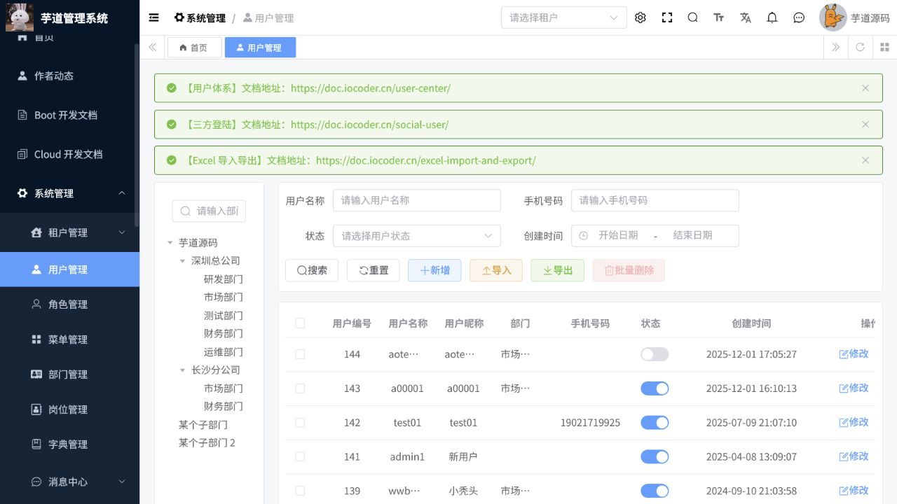
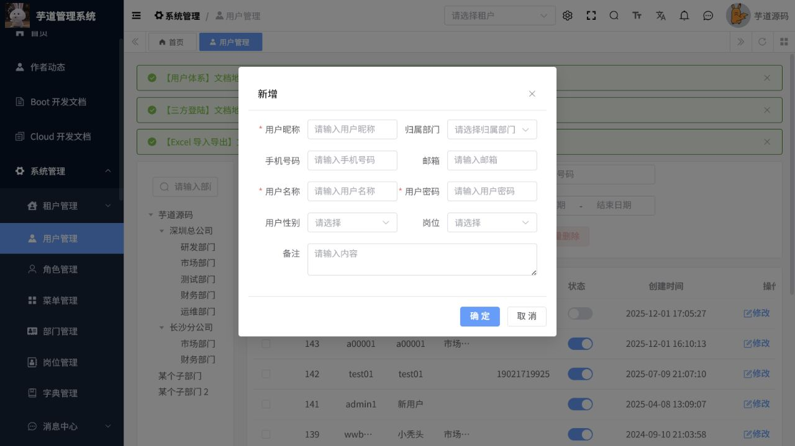

# 系统功能操作手册

> 文档作用：说明系统管理和基础设施模块的日常维护操作。
>
> 作者：DAMU
>
> 创建时间：2026-07-25

## 用户、部门与岗位

菜单路径：`系统管理 -> 用户管理 / 部门管理 / 岗位管理`。

先建立部门树和岗位，再新增用户并选择所属部门、岗位和角色。禁用用户会阻止后续登录，不会删除历史业务数据。调整部门或角色后，应让用户重新登录以刷新权限。

## 角色、菜单与数据权限

菜单路径：`系统管理 -> 角色管理 / 菜单管理`。

新建角色时配置菜单、按钮和数据范围；仅授予完成岗位职责所需的权限。菜单调整会影响所有绑定该角色的用户，发布前在低权限账号下验证。删除角色或菜单前，先解除用户和子菜单引用。

## 租户、字典和系统配置

菜单路径：`系统管理 -> 租户管理 / 租户套餐 / 字典管理`，以及 `基础设施 -> 配置管理`。

租户套餐决定租户可用菜单；先配置套餐，再分配给租户。字典类型用于限制表单选项，修改字典编码会影响引用它的页面和接口。配置参数变更应记录原值、用途和回退方法，涉及登录、文件、缓存或第三方密钥的参数必须经过审批。

## 通知、站内信与日志

菜单路径：`系统管理 -> 通知公告 / 站内信 / 登录日志 / 操作日志`；`基础设施 -> API访问日志 / API错误日志`。

发布公告前确认接收范围和生效时间。日志用于审计和排障，应通过时间、用户、模块和结果筛选，不应任意删除。出现业务异常时，先查看 API 错误日志，再关联访问日志的请求轨迹和操作日志。

## 文件、任务与代码生成

菜单路径：`基础设施 -> 文件管理 / 文件配置 / 定时任务 / 任务日志 / 代码生成`。

文件配置决定存储位置，变更前验证新存储可读写；文件管理中的删除会影响业务附件展示。定时任务先在非生产环境执行一次，确认参数和影响范围后再启用；失败任务结合任务日志处理。代码生成应选择已核对的表和包路径，生成前确认不会覆盖人工维护的代码。

## 接口、数据源与运维工具

菜单路径：`基础设施 -> 系统接口 / 数据源配置 / 数据库文档 / Redis监控 / Druid监控 / 服务监控`。

接口文档用于核对参数和响应，不应直接对生产接口发送破坏性请求。数据源配置修改后先做连通性验证。监控页面用于观察连接池、缓存和服务状态；发现异常峰值时保留截图和时间范围后再处置。

## 核心流程：新建用户并授权

**适用角色：** 系统管理员。**前置条件：** 部门、岗位、角色已建立，且管理员有用户和角色维护权限。

菜单路径：`系统管理 -> 用户管理`。

1. 进入用户管理，先按部门树定位归属部门；如用户已存在，先以用户名、手机或昵称检索，避免重复建档。
2. 点击“新增”，填写用户昵称、归属部门、手机号码、邮箱、用户名和初始密码；按岗位职责选择性别、岗位、角色和备注。
3. 保存后回到列表，按用户名查询，检查部门、状态和创建时间；使用受控测试账号重新登录，确认只出现授权模块。
4. 需要调岗时先调整部门和岗位，再调整角色及数据权限；禁用前先转移待办、业务负责人或审批办理人。

图 1：用户列表支持部门筛选、检索、新增、导入和导出。

图 2：新增用户时必须核对归属部门、登录用户名和角色；初始密码不得通过聊天工具或公告传播。

## 权限变更与审计核验

1. 在角色管理中复制相近角色后修改菜单、按钮和数据范围，减少遗漏；不要直接把系统管理员角色授予普通业务人员。
2. 在菜单管理中区分目录、菜单和按钮权限；新增按钮后同步授权至需要操作的角色。
3. 修改后以目标角色账号登录核验“能看、能查、能办”的最小权限范围，并在操作日志按管理员、时间和对象查询变更痕迹。
4. 发现权限越界时，立即停用相关角色或账号，保留日志编号并由管理员重新核查授权链路。

## 常见异常

| 现象 | 原因与处理 |
| --- | --- |
| 新增用户后无法登录 | 检查账号状态、初始密码、租户、角色及是否被锁定。 |
| 用户看不到新菜单 | 检查角色菜单、租户套餐和前端重新登录后的权限刷新。 |
| 日志找不到操作 | 以操作时间、账号和接口路径组合查询，并确认日志保留策略。 |
