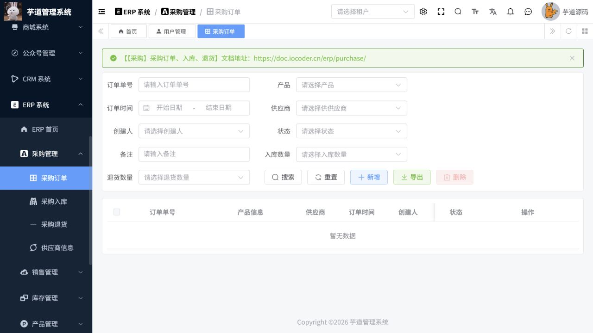
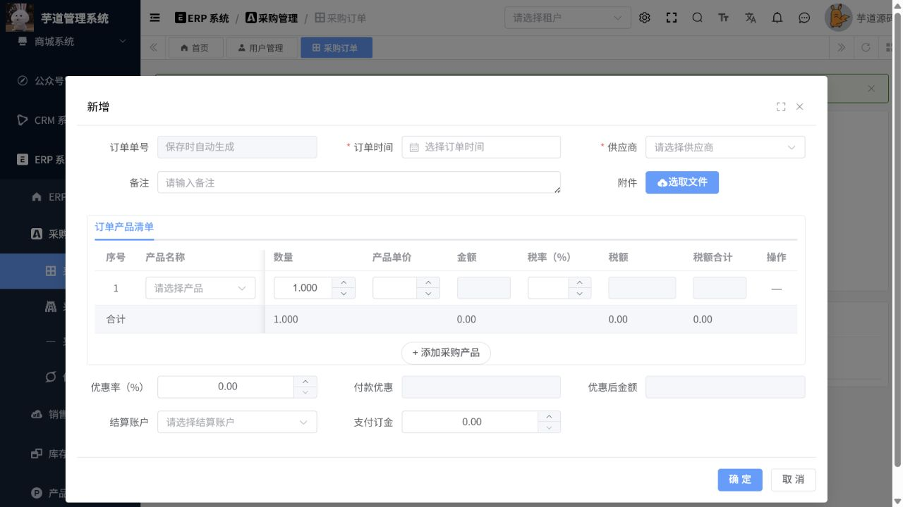
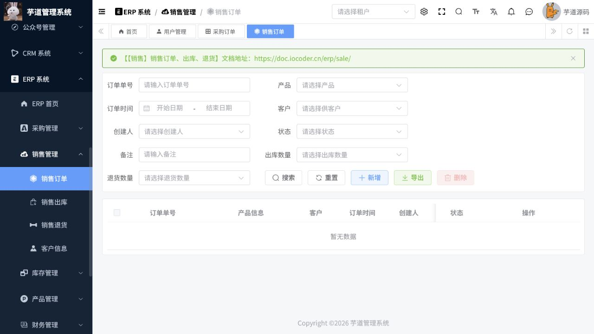
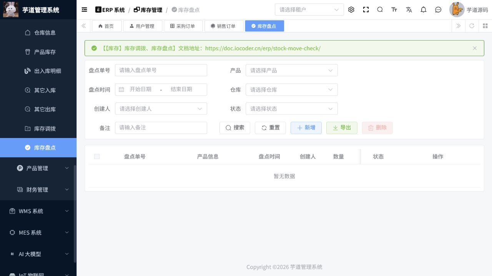
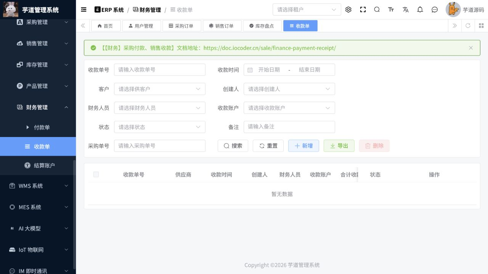

# ERP说明及操作手册

> 文档作用：说明 ERP 基础资料、采购、销售、库存和资金单据的标准业务闭环。
>
> 作者：DAMU
>
> 创建时间：2026-07-25

## 适用范围

ERP 页面覆盖产品分类、产品、单位、供应商、客户、仓库、采购入退库、销售出退库、库存调拨与盘点、收款、付款和资金账户。操作任何单据前，先确认本单位的单据审核和库存记账制度。

## 基础资料

菜单路径：`ERP -> 产品管理 / 采购管理 / 销售管理 / 库存管理 / 财务管理`。

1. 建立产品分类和计量单位，再新增产品并维护规格、采购价和销售价。
2. 新增供应商与客户，确认名称、联系人和结算信息。
3. 新增仓库并明确是否允许负库存、盘点和调拨。
4. 新增资金账户，限定可操作的财务人员。

基础资料被业务单据引用后，不应直接删除；使用停用或修改后续单据的方式处理。

## 采购业务

标准顺序为：采购订单 -> 采购入库 -> 采购付款；发生退货时使用采购退货单和付款退款关联操作。

创建采购订单时选择供应商、入库仓库和产品明细，核对数量、单价和税费后审核。根据订单生成或创建采购入库单，完成实物验收后确认入库。需要付款时，从采购入库或订单的可付款记录创建付款单，选择资金账户并登记实际金额。退货必须指向原采购来源，防止库存和应付余额失真。

## 销售业务

标准顺序为：销售订单 -> 销售出库 -> 销售收款；发生退货时使用销售退货单和收款退款关联操作。

创建销售订单时选择客户、出库仓库和产品明细，确认可用库存后审核。根据订单创建销售出库单，仓库完成拣货、复核和出库后确认。通过可收款记录创建收款单，选择资金账户并核对金额。客户退货应关联原销售单，据实入库后再办理退款。

## 库存业务

库存管理包含其他入库、其他出库、调拨、盘点、库存查询和库存流水。其他出入库必须填写业务原因；调拨单应明确调出仓和调入仓；盘点应先冻结盘点范围并登记实盘数量，再按差异单处理。库存流水是追溯数量变化的依据，不应以直接修改库存数量替代业务单据。

## 财务核对

付款单和收款单分别关联应付、应收来源及资金账户。每日或月末按“订单、出入库、应收应付、收付款、库存流水”逐层核对。已审核或已关联资金单据的业务更正，应使用退货、退款或反向单据，不应删除历史记录。

## 核心流程一：采购到付款

**适用角色：** 采购员、仓管员、财务人员。**前置条件：** 供应商、产品、仓库、结算账户已启用，且产品采购价、税率和权限范围已核对。

菜单路径：`ERP 系统 -> 采购管理 -> 采购订单`。

1. 在采购订单列表按订单号、产品、供应商、日期和状态查询，避免对同一需求重复下单。
2. 点击“新增”，填写订单时间和供应商；在订单产品清单中逐行选择产品、录入数量、单价与税率，必要时上传报价或合同附件。
3. 选择结算账户并录入支付订金；保存后核对订单金额、明细行、供应商、入库数量和退货数量均符合预期。
4. 到货验收后在`采购入库`新建或从订单带入明细，选择实际入库仓库，复核实收数量后确认入库。
5. 在`付款单`关联可付款来源，填写付款日期、付款账户和实际金额；付款后以订单、入库单、付款单和库存流水四个编号交叉核验。

图 1：采购订单列表用于按供应商、产品、状态和入退库数量追踪执行进度。

图 2：采购订单表单中的供应商、产品、结算账户为前置主数据；下拉无可选值时先补齐主数据，不可手工绕过。

## 核心流程二：销售到收款

**适用角色：** 销售员、仓管员、出纳。**前置条件：** 客户、产品、仓库、销售价和收款账户已建立，产品可用库存满足发货需求。

菜单路径：`ERP 系统 -> 销售管理 -> 销售订单`。

1. 新增销售订单，选择客户、订单日期、产品明细、数量、售价和税率；保存前确认客户信用、库存和交付日期。
2. 在销售出库中引用销售订单，仓库按拣货、复核、出库的实物结果确认数量；缺货时回到订单处理，不要虚假出库。
3. 在收款单中关联应收来源，录入实际收款账户、日期和金额；部分收款必须保留未收余额。
4. 客户退货时，按原销售来源建立销售退货和退款，不直接修改原订单或库存余额。

图 3：销售订单页面可结合客户、订单状态和出退库数量判断履约进度。

## 核心流程三：库存盘点与收款核验

1. 在`库存管理 -> 库存盘点`选择盘点仓库、盘点时间和产品范围；导出或打印盘点表后按实物录入盘点数量。
2. 复核账面数量、实盘数量和差异原因，确认后形成可追溯的差异处理记录；盘点期间避免并发出入库。
3. 在`财务管理 -> 收款单`按客户、收款时间、账户和状态筛选，核对收款金额与订单、出库及应收余额。

## ERP 异常处理

| 现象 | 处理原则 |
| --- | --- |
| 订单表单中无供应商、产品或账户 | 先到对应基础资料新增、启用并确认数据权限。 |
| 单据已确认却要更正 | 使用退货、退款、反向出入库或作废流程，保留历史链路。 |
| 库存与实物不一致 | 先冻结或限定盘点范围，按盘点差异单处理并追溯出入库明细。 |
| 收付款金额与订单不一致 | 核对部分收付、折扣、税费和退款单，禁止直接改写已完成流水。 |
