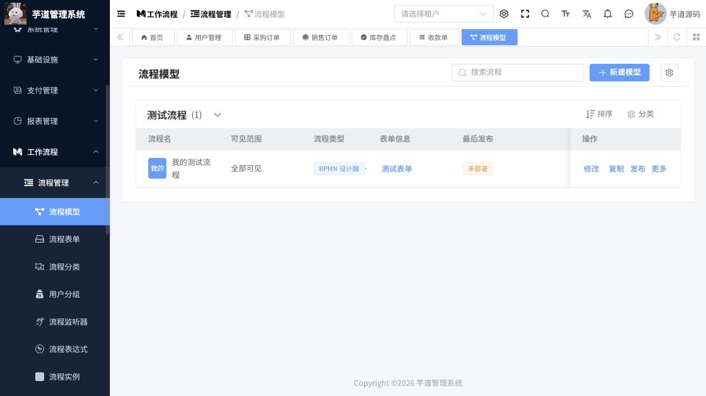
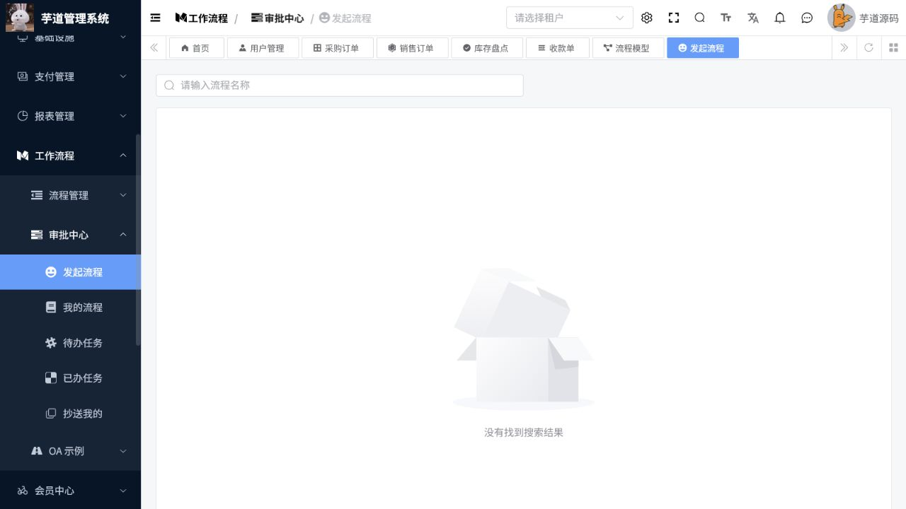

# 工作流操作手册

> 文档作用：说明流程模型配置、流程发起和任务审批操作。
>
> 作者：DAMU
>
> 创建时间：2026-07-25

## 流程管理员操作

菜单路径：`工作流程 -> 流程分类 / 流程表单 / 用户组 / 流程模型 / 监听器 / 表达式`。

先维护流程分类、表单和用户组，再创建流程模型。模型设计时配置节点、办理人、条件、抄送和表单权限；保存后进行模拟或测试发起，确认每个分支都有办理人。发布模型后才可供业务人员发起；已运行实例引用的模型不应直接删除。

## 发起流程

菜单路径：`工作流程 -> 我的流程 -> 发起流程`。

选择已发布流程，填写表单、上传必要附件并提交。提交后在“我的流程”查看当前节点、审批记录和流程图。信息填写错误时，优先在允许的状态下撤回；撤回后修改并重新提交。

## 审批任务

菜单路径：`工作流程 -> 待办任务 / 已办任务`。

打开待办后核对申请内容、附件、上一节点意见和业务规则，选择通过或驳回并填写意见。需要由其他人员处理时，按权限使用转办、委托或加签。已办任务仅用于查询历史处理结果，不能替代撤回或重新发起。

## 流程监控与异常

管理员通过流程定义、流程实例和流程任务页面查询状态与耗时。发现节点无人办理、条件未命中或表单不可用时，先核查模型版本、用户组、角色和表达式配置，再按组织流程处理实例。

## 核心流程：从模型发布到业务发起

**适用角色：** 流程管理员、发起人、审批人。**前置条件：** 流程分类、表单、办理人或用户组已配置；每个网关分支都有可命中的条件和可用办理人。

菜单路径：`工作流程 -> 流程管理 -> 流程模型`。

1. 点击“新建模型”，填写模型名称、流程分类和表单；进入设计器后配置开始事件、审批节点、条件分支、抄送和结束事件。
2. 对每个审批节点明确负责人来源，例如指定用户、角色、部门负责人或发起人自选；避免出现空办理人。
3. 保存并进行测试，重点验证金额阈值、部门分支、驳回路径和附件必填规则；确认后点击“发布”。
4. 发布后检查模型的启用状态、可见范围和发起权限，再让业务人员进入`审批中心 -> 发起流程`选择该流程并填写表单。
5. 发起人提交后在“我的流程”查看当前节点；审批人在“待办任务”填写意见并通过、驳回、转办或加签；流程结束后由发起人核对流程图和审批记录。

图 1：模型列表中“发布”前应完成表单、办理人和条件分支检查。

图 2：发起流程列表为空通常表示没有已发布且对当前账号可见的流程，应先核对模型发布状态、表单绑定和发起权限。

## 审批与异常处理

1. 审批前核对业务字段、附件、历史意见和当前节点；审批意见应描述依据而非只填写“同意”或“不同意”。
2. 驳回后由发起人按意见修改并重新提交；流程完成后的业务更正按模块业务规则处理，不得篡改审批历史。
3. 节点无人办理时依次检查节点办理人规则、组织负责人、角色成员、用户状态和数据范围；修复模型后用新实例验证，已运行实例按管理员权限处理。
