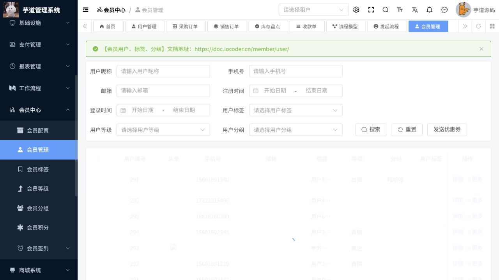

# 会员操作手册

> 文档作用：说明会员用户、等级、积分、标签、分组和签到配置及运营操作。
>
> 作者：DAMU
>
> 创建时间：2026-07-25

## 会员用户与画像

菜单路径：`会员中心 -> 会员用户 / 会员分组 / 会员标签`。

通过用户列表按手机号、昵称、注册时间和状态筛选；打开详情查看基本信息、积分、等级和关联记录。分组用于运营圈选，标签用于描述兴趣或行为。修改标签前确认规则和目标人群，避免覆盖人工维护的标记。

## 等级、积分与签到

菜单路径：`会员中心 -> 会员等级 / 积分配置 / 积分记录 / 签到配置 / 签到记录`。

等级规则应先定义成长值或经验值口径，再发布给会员。积分配置明确获取、消耗、有效期和上限；运营人员通过积分记录追溯变动，异常调整必须填写原因。签到配置改变后，先验证连续签到和奖励计算，再对外启用。

## 运营注意事项

会员数据含个人信息，应按最小权限访问。禁用或删除会员前确认其是否有未完成订单、售后或资金记录。会员相关的短信、公众号和商城活动需要分别完成渠道配置后才会生效。

## 核心流程：会员筛选、标签运营与资产核验

**适用角色：** 会员运营、客服。**前置条件：** 已配置会员等级、标签、分组和优惠券规则；操作人具备会员信息与优惠券发放权限。

菜单路径：`会员中心 -> 会员管理`。

1. 使用用户昵称、手机号、邮箱、注册时间、标签、等级和分组筛选目标会员；先通过手机号或会员编号排除重名记录。
2. 打开会员详情，核对基础信息、状态、积分、等级、登录时间、订单和优惠券资产；只处理当前业务范围内的字段。
3. 为明确的运营目的维护标签或分组，例如“新注册未下单”“高复购”“售后跟进”；记录筛选口径和生效时间，避免将临时标签当作长期画像。
4. 点击“发送优惠券”前核对券批次、有效期、适用商品和库存；发放后回到会员资产或优惠券记录核验数量与状态。
5. 对积分、成长值或等级的异常，先查积分记录和业务来源，再按配置或审批规则调整，不直接修改汇总值。

图 1：会员管理支持按基本信息、标签、等级和分组筛选，并提供优惠券发放入口；页面无数据时先检查当前租户和演示数据。

## 异常与边界

| 现象 | 处理方式 |
| --- | --- |
| 会员检索不到 | 清空筛选条件，确认手机号格式、数据权限和当前租户。 |
| 优惠券无法发送 | 检查券批次状态、剩余库存、有效期与会员领取限制。 |
| 积分与活动不一致 | 按积分记录追溯来源，保留业务单号后再做补偿。 |

短信、公众号、商城和支付均为独立外部或业务边界；会员资料维护本身不会自动完成通知发送、订单退款或权益核销。
