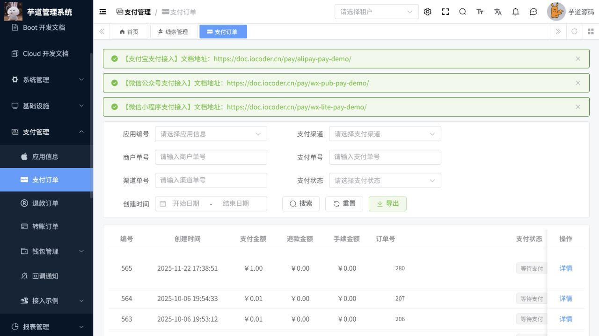

# 支付操作手册

> 文档作用：说明支付商户、应用、渠道及支付、退款、转账、钱包订单的管理方式。
>
> 作者：DAMU
>
> 创建时间：2026-07-25

## 启用条件

支付模块需要合法的商户号、应用标识、渠道证书或密钥、回调地址和网络连通性。当前本地配置中的回调地址只适合本地联调；未配置真实渠道时，不应发起真实扣款、退款或转账。

## 商户、应用与渠道

菜单路径：`支付管理 -> 商户信息 / 应用信息 / 支付渠道`。

先建立商户，再创建并绑定应用；一个应用可按业务需要配置多个渠道。保存渠道前核对编码、费率、证书、私钥和回调地址，完成沙箱或测试环境支付验证后再启用。停用渠道会影响新订单支付，不会自动终止已创建订单。

## 订单处理

菜单路径：`支付管理 -> 支付订单 / 退款订单 / 转账订单 / 钱包流水 / 回调日志`。

支付订单用于查询创建、支付中、成功、关闭等状态。退款必须关联原支付订单，并且金额不得超过可退金额。转账前核对收款方、金额和风控规则。回调日志是渠道结果的审计依据，重复通知应由系统幂等处理，运营人员不应通过手工修改订单状态伪造支付结果。

## 对账与异常

按商户、应用、渠道和时间范围导出订单，与渠道账单核对。订单状态异常时先检查回调日志、渠道配置和网络，再按渠道规则补单或关闭；涉及资金差异时保留订单号、渠道流水号和证据后交由财务处理。

## 核心流程：支付订单查询与退款处理

**适用角色：** 财务、支付运营。**前置条件：** 支付应用、渠道和回调地址已配置，退款经业务审核；生产操作必须具备资金授权。

菜单路径：`支付管理 -> 支付订单`。

1. 按应用编号、支付渠道、商户单号、支付单号、渠道单号、支付状态和创建时间查询订单；优先用订单号或渠道单号定位唯一记录。
2. 打开订单详情，核对支付金额、退款金额、手续费、商品标题、支付时间与应用信息；状态为处理中时先查询回调通知，避免人工重复处理。
3. 需要退款时进入`退款订单`，选择或关联原支付订单，填写退款金额和原因；退款金额不得超过原订单可退余额。
4. 提交后记录退款单号，等待渠道结果；在退款订单、原支付订单和回调通知中核对状态、金额及渠道流水号。
5. 日结时按应用和渠道导出订单，与渠道账单逐笔或按汇总金额对账；差异只可通过渠道规则补单、关闭或财务调账处置。

图 1：支付订单页面提供应用、渠道、商户单号、支付单号和状态等检索项；列表为空并不表示渠道未配置，应结合查询条件和回调日志判断。

## 资金安全规则

1. 页面可见不代表已经具备生产支付能力，真实扣款、退款和转账前必须完成渠道签约、证书、密钥、回调和风控验证。
2. 不在表单、截图、日志或手册中记录完整密钥、证书私钥或个人收款信息。
3. 同一支付或退款请求出现超时、未知状态时，先以商户单号查询渠道结果；未查明前不得重复提交。
