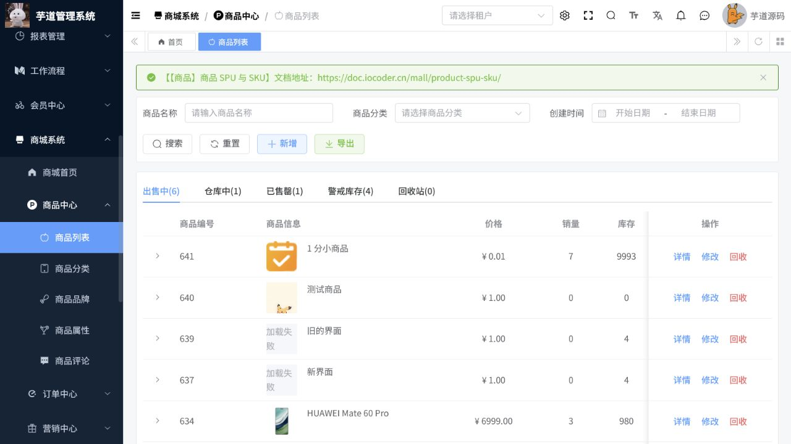
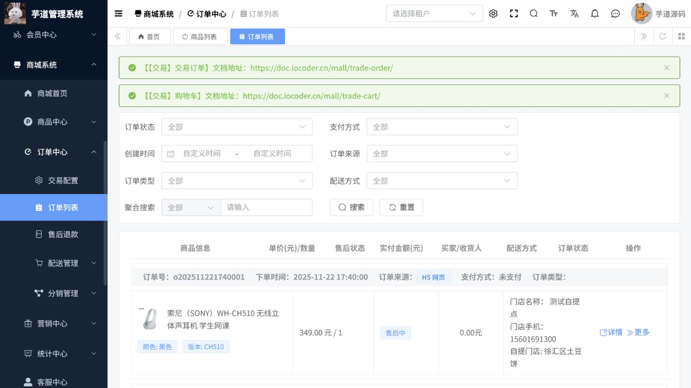

# 商城操作手册

> 文档作用：说明商品、营销、装修、交易和售后运营操作。
>
> 作者：DAMU
>
> 创建时间：2026-07-25

## 商品中心

菜单路径：`商城管理 -> 商品中心 -> 品牌 / 分类 / 属性 / 商品`。

先建立品牌、分类和规格属性，再新建商品 SPU 与 SKU。商品上架前核对售价、库存、图片、运费、规格和售后说明；下架商品不会取消已创建订单。商品详情、收藏、浏览记录和评价用于运营分析，不应用于直接修改交易数据。

## 营销与页面装修

菜单路径：`商城管理 -> 营销中心 / 装修中心`。

营销中心包含优惠券、满减、限时折扣、秒杀、拼团、砍价和奖励活动。创建活动时设置时间、适用商品、库存、限购和叠加规则，并在预发布环境验证价格计算。装修中心用于维护页面模板和页面内容；发布前预览移动端与管理端效果，避免覆盖正在使用的页面。

## 订单、发货与售后

菜单路径：`商城管理 -> 交易中心 -> 订单 / 售后 / 快递配送`。

订单处理顺序为支付确认、备货、发货、物流跟踪、收货和售后。发货前核对商品、数量、收货信息和物流单号。售后申请应查看原订单、商品状态和退款金额，再按退货退款或仅退款规则处理。物流和支付依赖外部服务，启用前必须配置对应渠道。

## 数据分析

商城首页和统计页面用于查看商品、订单、客户和营销效果。分析数据应按时间、店铺或活动口径过滤，并与订单明细交叉核对后再用于经营决策。

## 核心流程一：商品建档与上架

**适用角色：** 商品运营。**前置条件：** 商品分类、品牌、规格属性、运费模板和库存策略已配置；商品图片与描述通过合规审核。

菜单路径：`商城系统 -> 商品中心 -> 商品列表`。

1. 先按商品名称、分类和创建时间检索，确认不存在同款重复商品；在出售中、仓库中、已售罄和回收站标签中核查历史状态。
2. 点击“新增”，选择分类与规格，维护商品名称、卖点、图文详情、SKU 价格、库存、成本、重量和售后规则。
3. 保存后检查 SKU 组合、售价、库存和运费；预览商品详情，再将状态切换为上架。测试商品应明确标记且不对真实用户开放。
4. 上架后回到商品列表按名称查询，核对上架状态、销量、库存和警戒库存；需要停止销售时下架，不直接删除有订单关联的商品。

图 1：商品列表按经营状态分组显示价格、销量、库存和上架状态，是商品发布后的首要核验页面。

## 核心流程二：订单履约与售后

**适用角色：** 客服、仓储、订单运营。**前置条件：** 商品已上架且库存充足，支付和物流渠道已按环境配置。

1. 进入`商城系统 -> 订单中心 -> 订单列表`，按订单状态、支付方式、订单来源、订单类型和配送方式筛选待处理订单。
2. 打开订单详情，核对买家、商品 SKU、数量、实付金额、优惠、收货地址和支付状态；未支付订单不能作为正常发货依据。
3. 对待发货订单完成拣货、复核和物流单号录入后发货；回到列表确认状态变为已发货，并按物流回传追踪签收。
4. 售后申请必须关联原订单；核对商品退回、退款金额和支付状态后，按仅退款或退货退款流程处理，完成后在订单与售后记录双向核验。

图 2：订单列表可直接区分待支付、待发货、已发货、已完成和已取消，并显示售后状态、支付与配送信息。

## 异常处理

库存不足时先补货或下架，不通过修改已支付订单数量规避；支付或物流未回传时查渠道配置和订单回调，不手工伪造完成状态；营销价格异常时暂停活动并复核适用商品、叠加规则和活动时间。
