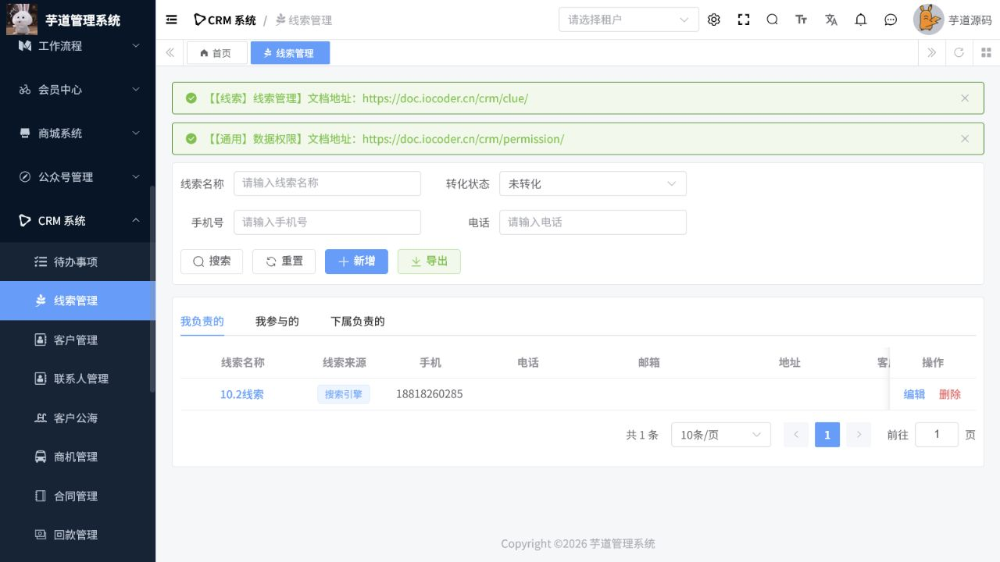
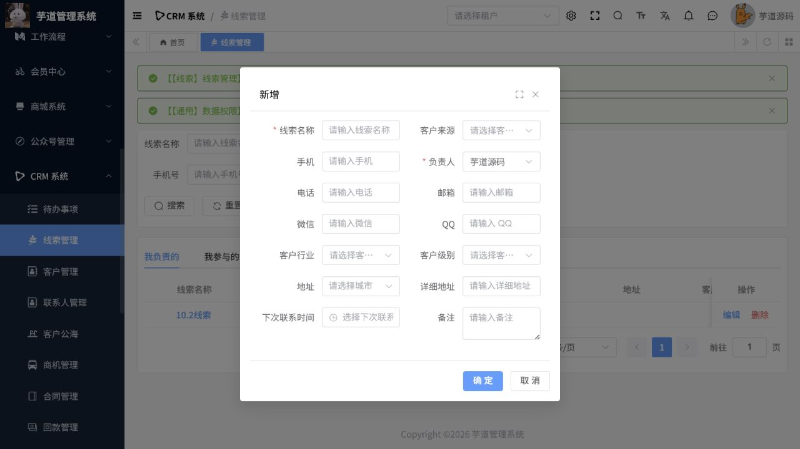

# CRM操作手册

> 文档作用：说明客户关系、销售机会、合同、回款和销售统计操作。
>
> 作者：DAMU
>
> 创建时间：2026-07-25

## 客户与联系人

菜单路径：`CRM -> 线索 / 客户 / 联系人 / 跟进记录 / 商机`。

线索是潜在客户的初始记录；核验来源、需求和负责人后，将有效线索转化为客户或商机。客户页面维护基本资料、行业、地区、负责人和联系人；同一客户应避免重复建档。每次沟通通过跟进记录保存时间、方式、内容和下次行动，便于团队交接。

## 销售过程

销售人员在商机中维护预期金额、成交概率、阶段和预计成交日期。阶段变更应基于真实沟通和材料，不应只为改善报表而修改。需要报价或签约时，先确认客户、产品和价格信息，再创建合同；合同生效后按回款计划登记应收与实际回款。

## 权限与业绩

菜单路径：`CRM -> 客户公海 / 业绩目标 / 销售排行 / 客户分析`。

客户公海和领取规则由管理员配置，领取或退回前确认归属关系。客户、商机和合同通常受负责人及数据范围控制。业绩目标和统计用于分析，不应直接替代合同、回款和财务凭证。

## 常见核查

客户无法查看时，检查负责人、协作成员和角色数据权限；合同或回款无法创建时，检查上游客户、商机和必填产品。涉及金额变动的更正应留下跟进记录和审批依据。

## 核心流程：线索到客户、商机与回款

**适用角色：** 销售、客户经理、销售主管。**前置条件：** 负责人、客户来源、行业、客户级别、产品和数据权限已配置。

菜单路径：`CRM 系统 -> 线索管理`。

1. 先按线索名称、手机号、电话和转化状态搜索，排除重复线索后点击“新增”。
2. 填写线索名称、客户来源、手机或电话、负责人、行业、客户级别、地址、下次联系时间和备注；负责人是后续数据权限与业绩归属的重要字段。
3. 保存后回到“我负责的”列表检索新线索，确认来源、负责人、下次联系时间和创建人。每次沟通后追加跟进记录并更新下一步行动。
4. 线索确认有效后按业务规则转化为客户或商机，建立联系人、销售阶段、预计金额和预计成交日期；重复客户须合并或改为跟进，不能重复建档。
5. 商机成交后新建合同，按合同创建回款计划和实际回款；回款金额、日期和凭据应与财务系统一致，CRM 不替代资金凭证。

图 1：线索列表提供负责人范围切换和转化状态筛选，用于销售主管核查归属与跟进进度。

图 2：新增线索时至少填写线索名称和负责人，并尽可能保留来源、联系方式和下一次联系时间以支持后续转化。

## 销售过程核验与异常

1. 每周按“我负责的”“我参与的”“下属负责的”范围检查待跟进线索、逾期联系和长期未更新商机。
2. 客户无法转化或合同无法创建时，先检查必填客户、联系人、商机和产品信息；不要以创建虚假客户绕过引用关系。
3. 客户归属争议通过负责人、协作成员、客户公海规则和跟进记录处理，禁止直接删除有合同、商机或回款关联的客户。
