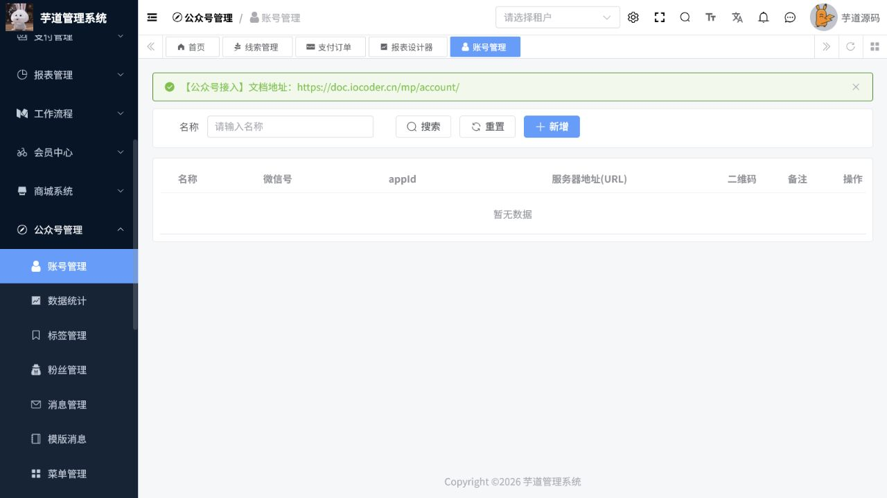

# 公众号操作手册

> 文档作用：说明微信公众号账号、菜单、素材、用户和自动回复管理。
>
> 作者：DAMU
>
> 创建时间：2026-07-25

## 启用条件

需要已认证的微信公众号、合法的 AppId 与 AppSecret、服务器回调地址和可访问的 Redis 配置。示例或本地占位凭据不能用于真实消息发送、菜单发布或用户同步。

## 账号与菜单

菜单路径：`公众号管理 -> 公众号账号 / 自定义菜单`。

先建立公众号账号并完成授权验证，再维护自定义菜单。菜单可包含点击、跳转和小程序类动作；发布前检查链接域名、菜单层级和文案。发布会覆盖公众号线上菜单，应先在测试号验证。

## 素材、消息与用户

菜单路径：`公众号管理 -> 素材管理 / 用户管理 / 标签管理 / 消息管理 / 自动回复`。

上传图文、图片、语音或视频素材前确认版权和大小限制。用户及标签信息用于运营分群；群发、模板消息和自动回复必须先确认目标范围、频率和退订要求。消息记录用于追溯发送结果，不应以重复发送替代失败排查。

## 数据统计与故障处理

统计页面用于观察关注、消息和素材效果。同步或发送失败时，核对账号授权、令牌、回调 URL、网络和微信平台日志；不要在未核实原因时反复发布菜单或群发消息。

## 核心流程：接入账号并发布菜单

**适用角色：** 公众号管理员、新媒体运营。**前置条件：** 已获得合法公众号授权信息，回调地址、Token、消息加解密配置和网络连通性均已验证。

菜单路径：`公众号管理 -> 账号管理`。

1. 点击“新增”，填写账号名称、微信号、AppId、AppSecret、服务器地址和备注；敏感凭据只在受控表单中录入，不写入文档、截图或群聊。
2. 保存后完成微信平台侧的服务器配置校验，再同步基础信息；从列表打开账号，确认名称、微信号、AppId 和服务器地址可查。
3. 进入`菜单管理`，按一级、二级菜单配置点击、跳转或小程序动作；核对链接域名、页面路径、菜单层级和文案。
4. 先在测试号或灰度账号验证菜单，再发布到正式账号；发布会覆盖线上菜单，必须保留发布前版本和回滚方案。
5. 通过消息管理、自动回复和数据统计检查回调、发送和用户增长结果；失败时按微信平台回执排查，不重复群发。

图 1：账号管理列表维护名称、微信号、AppId 和服务器地址；当前为空时需先完成账号授权及接入配置。
