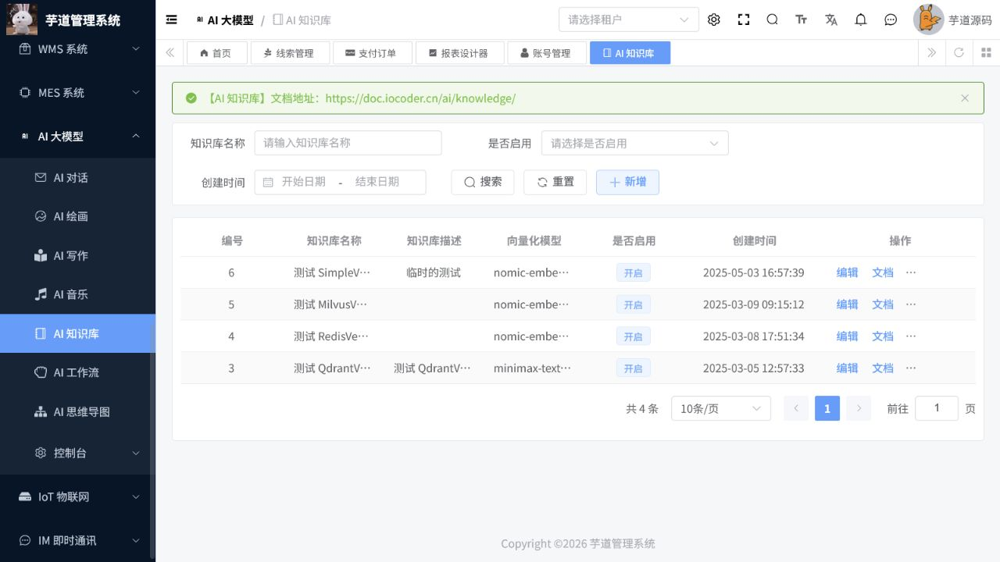

# AI操作手册

> 文档作用：说明 AI 模型、知识库、聊天、工作流、绘图、音乐、写作和思维导图能力的管理与使用。
>
> 作者：DAMU
>
> 创建时间：2026-07-25

## 启用条件

AI 功能需要模型服务地址与密钥；知识库还需要向量存储和嵌入模型。当前本地配置排除了多个未配置的向量库和模型自动装配，因此页面可见不代表对话、向量检索或生成任务已可执行。

## 模型与知识库管理

菜单路径：`AI -> 模型管理 / 知识库 / 知识库文档`。

管理员先配置并测试模型，再按用途分配给对话、图像、音频或嵌入任务。创建知识库后上传经过脱敏和审核的文档，等待解析、分段和向量化完成后再进行检索测试。修改模型或知识库权限前，评估对已有应用和会话的影响。

## 日常使用

菜单路径：`AI -> 聊天 / 工作流 / 写作 / 绘图 / 音乐 / 思维导图`。

使用者应明确输入目标、上下文和输出格式，不提交密码、证书、客户隐私或受保护数据。工作流发布前在测试数据上校验每个节点；生成图片、音乐和文本前确认版权、内容安全和预算。AI 输出需经人工复核后才能用于客户沟通、经营决策或正式文件。

## 异常核查

模型调用失败时，检查模型密钥、额度、网络、模型类型和访问权限。知识库无法检索时，检查文档解析状态、嵌入模型与向量库连接。记录请求时间和任务编号，避免通过重复提交制造重复消费。

## 核心流程：建立知识库并进行召回测试

**适用角色：** AI 应用管理员、知识管理员。**前置条件：** 嵌入模型、向量存储和文件解析能力已连通；待导入材料已经脱敏、审核并确认版权。

菜单路径：`AI 大模型 -> AI 知识库`。

1. 先按名称和启用状态检索已有知识库，避免为同一知识域重复创建多个库。
2. 点击“新增”，填写知识库名称、描述，选择可用的向量化模型和启用状态；保存后记录用途、负责人和知识范围。
3. 点击“文档”上传或维护资料，等待解析、切分和向量化完成；处理失败的文档应先检查格式、大小、模型和向量库连接。
4. 点击“召回测试”，输入已知问题，核对命中文档、片段、相似度和回答引用；根据结果调整文档质量、分段或模型配置。
5. 仅在测试通过后将知识库绑定到聊天应用或工作流；模型响应仍须人工审核，尤其是涉及客户、合同、财务或生产决策的内容。

图 1：知识库列表显示向量化模型和启用状态，并提供文档维护、召回测试等关键操作。
