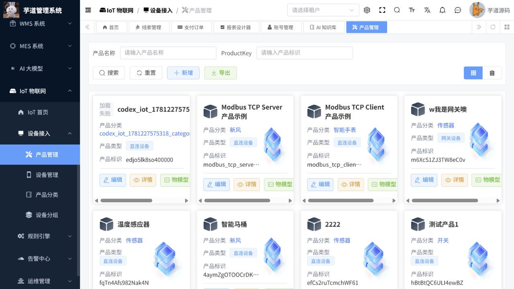

# IoT操作手册

> 文档作用：说明物联网产品、设备、物模型、规则、告警和 OTA 管理操作。
>
> 作者：DAMU
>
> 创建时间：2026-07-25

## 启用条件

IoT 功能依赖设备接入网关、协议配置、消息通道、时序数据库和设备网络连通性。本地配置中的 TDengine 数据源为按需连接；若设备消息表或时序服务未初始化，统计和消息页面可能报错，需先完成数据库与网关部署。

## 产品与物模型

菜单路径：`物联网 -> 产品管理 / 物模型 / 设备管理`。

先创建产品并选择协议与认证方式，再定义属性、服务和事件的标识、数据类型、范围与单位。物模型发布前应由设备固件团队确认兼容性。创建设备时记录设备标识、所属产品、状态和安装位置，避免在生产环境重复注册同一设备。

## 设备运行、规则与告警

菜单路径：`物联网 -> 设备管理 / 规则引擎 / 告警管理 / 设备日志`。

设备上线后查看属性、事件、位置和消息记录。规则引擎用于把设备事件路由到通知、存储或业务动作，启用前先用测试设备验证条件和频率。告警规则要明确阈值、级别、接收人和恢复条件，避免告警风暴。

## OTA 升级

菜单路径：`物联网 -> OTA管理`。

上传固件前验证型号、版本、校验值和回滚方案。先对少量测试设备灰度发布，确认稳定后再扩大范围。升级失败时保留设备日志与版本信息，不要重复下发未知固件。

## 核心流程：创建产品、定义物模型并接入设备

**适用角色：** 设备管理员、IoT 实施与运维人员。**前置条件：** 设备协议、认证方式、消息通道和设备固件字段已由技术团队确认。

菜单路径：`IoT 物联网 -> 设备接入 -> 产品管理`。

1. 按产品名称或 ProductKey 搜索，确认产品不存在后点击“新增”；填写产品名称、分类、产品类型、协议和认证方式。
2. 保存后在列表检查产品名称、产品分类、产品类型和产品标识；ProductKey 是设备接入引用，发布后不要随意改变。
3. 点击“物模型”，为属性、服务和事件定义标识、数据类型、单位、范围和读写权限；与设备固件逐项联调。
4. 在设备管理中创建或导入设备，绑定产品并记录设备标识、安装地点、责任人和状态；上线后查看遥测、事件和日志。
5. 规则引擎和告警仅先对测试设备启用，验证频率、去重、恢复条件和接收人后再逐步扩容。

图 1：产品列表展示产品分类、类型和 ProductKey，并提供详情和物模型入口；截图中的“加载失败”表示图像或外部资源未加载，不影响产品信息核对。
