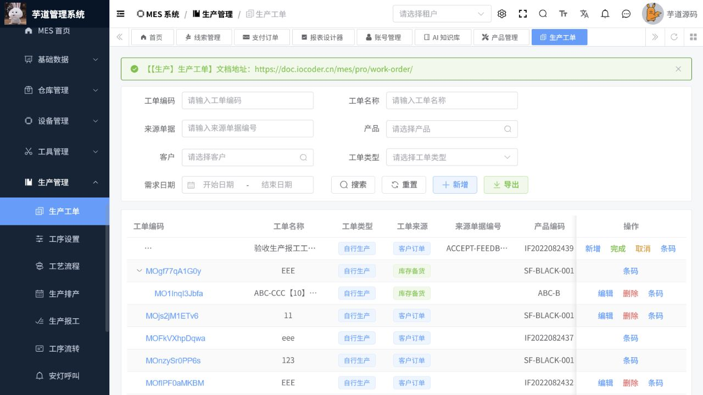

# MES操作手册

> 文档作用：说明制造执行系统的主数据、计划、生产、质量、设备、工装和车间物料操作。
>
> 作者：DAMU
>
> 创建时间：2026-07-25

## 主数据与生产准备

菜单路径：`MES -> 基础资料 -> 物料、物料分类、单位、客户、供应商、车间、工作站、工艺路线、工序、BOM、SOP`。

先维护物料、单位、分类、供应商和客户，再建立车间、工作站、工序、工艺路线、BOM 与作业指导书。变更 BOM 或工艺路线应设置适用版本和生效范围，避免影响已下达工单。

## 日历、计划与工单

菜单路径：`MES -> 日历管理 / 生产管理 -> 生产工单、生产任务、生产派工、生产报工`。

先配置班组、班次、工作日历和生产计划，再创建生产工单。工单审核或下达后按工序派工，作业人员依据任务执行报工。报工时核对产出数量、合格数量、不良数量、工时和设备信息；撤销或补录应遵循现场管理制度。

## 质量、设备与工装

菜单路径：`MES -> 质量管理 / 设备管理 / 工装管理`。

质量模块覆盖检验模板、指标、来料检验、过程检验、出货检验、巡检和不良记录。设备模块维护设备台账、点检计划、维修和保养记录；工装模块维护工装类型和台账。检验不合格、设备故障或工装异常应形成可追溯记录，并按规则阻断或放行生产。

## 车间物料与追溯

菜单路径：`MES -> 车间物料 -> 领料、退料、补料、入库、生产入库、产品销售、批次、条码、包装`。

标准顺序为：按工单领料 -> 生产报工 -> 产成品入库 -> 批次和条码追溯。物料消耗、产品产出和批次数据必须与实际一致。退料、补料、委外收发和销售退回应使用对应单据，不应直接改写库存。

## 核心流程：生产工单到报工完工

**适用角色：** 计划员、车间主管、班组长、报工人员。**前置条件：** 产品、BOM、工艺路线、工作站、班组、客户和日历已配置，库存或领料条件满足生产需求。

菜单路径：`MES 系统 -> 生产管理 -> 生产工单`。

1. 按工单编码、名称、来源单据、产品、客户、需求日期和状态查询，先确认没有对同一销售需求重复下单。
2. 点击“新增”，填写工单编码、名称、工单类型、来源单据、产品、数量、客户和需求日期；保存后复核单位、规格、计划数量和交期。
3. 经确认后按工艺路线生成生产任务或派工，指定工作站、班组、人员和计划时间；现场领取物料时关联工单和批次。
4. 作业完成后登记生产报工，准确录入合格数、不良数、工时、设备、工序和原因；超过工单数量或状态不允许报工时先处理前置异常。
5. 工单完成后生成产成品入库和条码/批次记录，核对已生产数量、工单状态和库存变化；取消或更正使用对应状态或反向单据。

图 1：生产工单列表同时显示工单编码、产品、数量、客户、需求日期和草稿/已确认/已完成等状态，适合作为生产执行核验入口。
