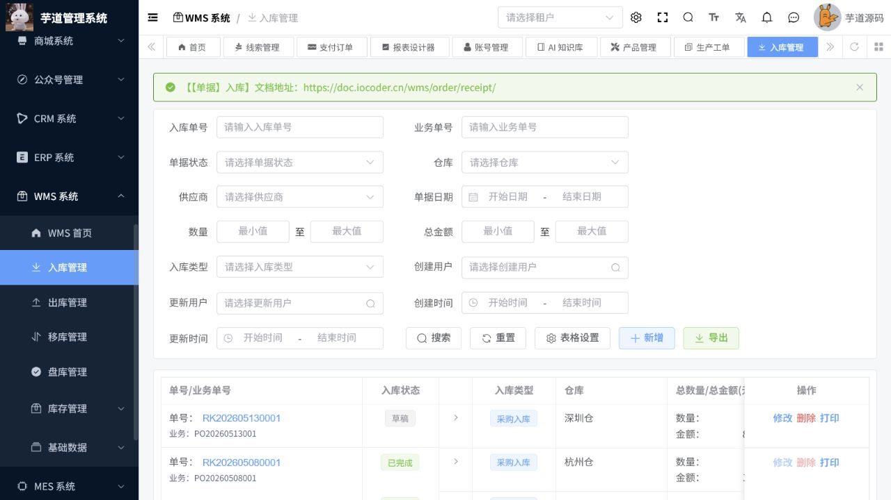

# WMS操作手册

> 文档作用：说明仓储主数据、收货、发货、移库、盘点和库存查询操作。
>
> 作者：DAMU
>
> 创建时间：2026-07-25

## 基础资料

菜单路径：`WMS -> 基础资料 -> 货主、仓库、货品、货品分类、品牌、SKU`。

先维护货主、仓库、货品分类、品牌和货品，再生成或维护 SKU。货品编码、条码、单位、保质期和批次规则要与 ERP 或上游系统保持一致。已发生库存或订单的资料不应直接删除。

## 入库与收货

菜单路径：`WMS -> 作业管理 -> 收货单`。

创建收货单时选择货主、仓库、货品、数量和批次要求；到货后执行收货、质检或上架确认。确认前核对实物、条码、数量和库位，确认后库存会发生变化。收货差异应通过单据备注和差异流程处理。

## 发货、移库与盘点

菜单路径：`WMS -> 作业管理 -> 发货单 / 移库单 / 盘点单`。

发货单按拣货、复核和出库顺序处理，出库前核对订单、货品、数量、批次和收货信息。移库单必须明确来源库位和目标库位；盘点单先确定范围，再登记实盘数量和差异。库存调整应由盘点或授权业务单据产生，不能通过修改查询页面数据完成。

## 库存与追溯

菜单路径：`WMS -> 库存管理 -> 库存总览 / 库存流水`。

库存总览用于查看现存量、可用量和锁定量，库存流水用于追溯每次作业导致的变化。出现账实不符时，按“流水 -> 原始作业单 -> 现场复核 -> 盘点差异处理”定位，不要直接覆盖账面数量。

## 核心流程：入库收货、上架与库存核验

**适用角色：** 收货员、库管员、仓库主管。**前置条件：** 仓库、货主/供应商、货品、SKU、批次和库位规则已启用；采购或生产来源单据可追溯。

菜单路径：`WMS 系统 -> 入库管理`。

1. 按入库单号、业务单号、状态、仓库、供应商、日期和入库类型查询；先检查是否已有待处理单据。
2. 新建入库单时选择入库类型、仓库、供应商和业务来源，录入货品、数量、金额、批次和备注；需质检的货品先进入待检流程。
3. 到货时扫描或核对条码、实收数量、批次、效期和库位；差异记录在单据备注或差异流程中，不得修改来源单掩盖差异。
4. 执行上架或确认后，回到列表核验单据状态、仓库、总数量、总金额和业务单号；再到库存总览和库存流水核验数量变动。
5. 已完成单据如需退货、作废或更正，按状态和业务来源使用退货、冲销或授权流程，不能删除已影响库存的历史单据。

图 1：入库列表展示单号、业务来源、状态、类型、仓库、数量、金额、供应商与操作记录，可用于收货完成后的闭环复核。
