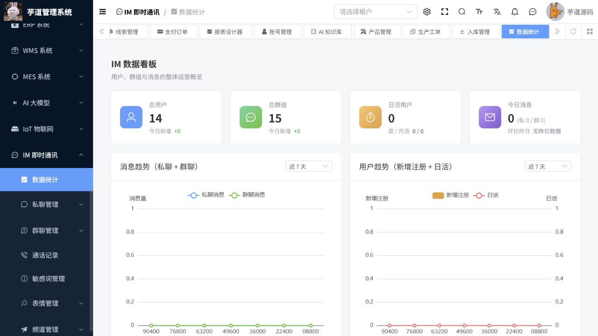

# 即时通讯操作手册

> 文档作用：说明即时通讯管理端的用户、好友、群组、消息、会话、敏感词和统计管理。
>
> 作者：DAMU
>
> 创建时间：2026-07-25

## 启用条件

即时通讯基础管理功能依赖数据库和本地 WebSocket 配置；实时音视频、LiveKit 等能力还需要独立服务和访问凭据。未配置外部音视频服务时，不应将通话或会议功能作为可用能力交付。

## 用户、好友与群组

菜单路径：`即时通讯 -> 用户管理 / 好友管理 / 群组管理 / 群申请`。

管理员可查询用户状态、好友关系、群成员和入群申请。处理申请前核对用户身份和组织规则；删除好友或解散群组会影响会话可见性，应遵循数据保留策略。不要以管理员身份代替普通用户发送私人内容。

## 消息、会话与内容治理

菜单路径：`即时通讯 -> 会话管理 / 消息管理 / 敏感词 / 表情包 / 消息模板`。

通过会话和消息记录排查投递、阅读和内容问题。敏感词规则发布前先用测试消息验证命中范围，避免过度拦截正常业务词。消息模板和表情包资源应经过内容审核；删除或隐藏内容前保留必要的审计信息。

## 统计与异常

菜单路径：`即时通讯 -> 数据概览 / 运营统计`。

统计页面可查看消息趋势、用户趋势、群规模和活跃度。统计或消息接口异常时，检查数据库表、WebSocket 服务、缓存和权限，再结合 API 错误日志定位。音视频异常另行检查 LiveKit 或对应媒体服务状态。

## 核心流程：运营数据核查与内容治理

**适用角色：** IM 运营、客服管理员、内容治理人员。**前置条件：** 管理端角色具备统计、会话、群聊和敏感词权限；实时服务运行状态已确认。

菜单路径：`IM 即时通讯 -> 数据统计`。

1. 进入数据看板，先确认统计周期，再查看总用户、今日新增、总群组、日活、今日消息、消息趋势和群规模分布。
2. 发现异常下降或峰值时，记录时间窗口，再进入私聊管理、群聊管理或消息管理按用户、群组和内容类型检索；不要仅依据汇总数直接删除内容。
3. 对违规内容先按组织规范保留必要审计证据，再在敏感词管理中调整规则；新规则先以测试消息验证，避免误伤业务词。
4. 用户、群组或消息问题要同时检查权限、WebSocket、缓存和接口日志；音视频问题另行检查媒体服务，不以消息看板状态替代媒体健康检查。

图 1：看板汇总用户、群组、活跃与消息趋势，适合用于日常运营巡检和异常时间点定位。
